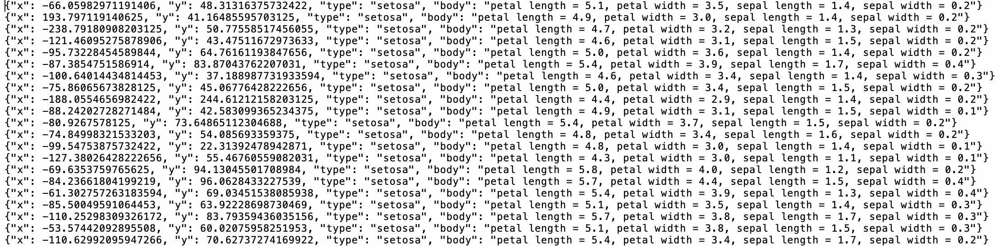
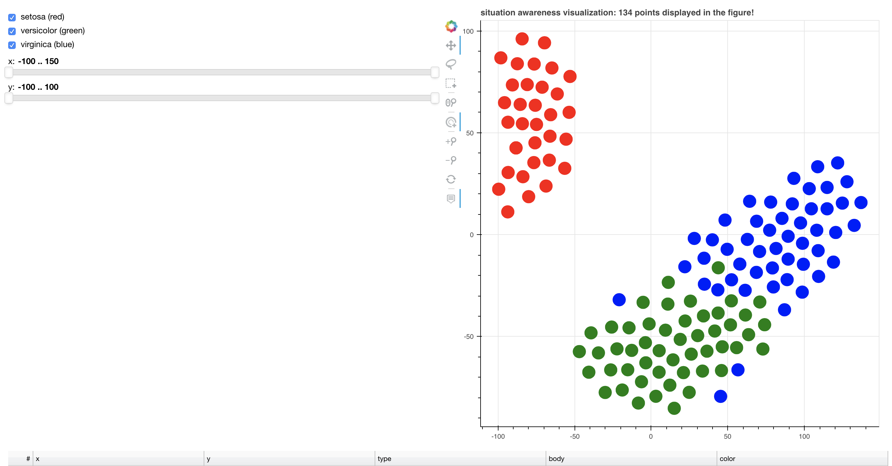
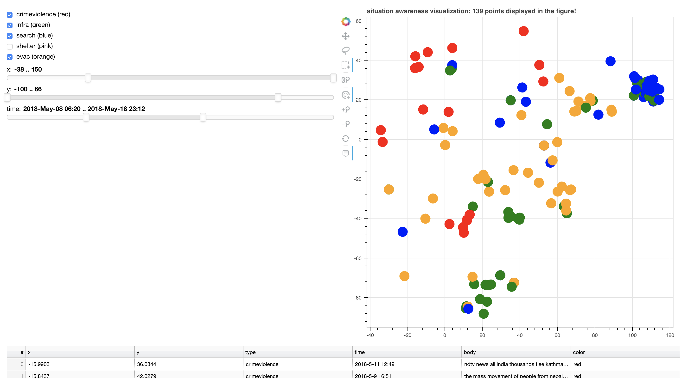

# Situation Awareness Visualization (SAVIZ)

Situation Awareness Visualization (SAVIZ) is a tool to visualization, implemented under ISI. 

## Introduction

In order to help our research team to evaluation efficient. This tool was implemented under [bokeh](https://bokeh.pydata.org/en/latest/), which is a powerful framework in visualization domain. However, it is difficult to use and we need spend more time to understand and implement through this framework. Taking into account our needs and making it easier to make evaluation and visualization for research, our team. Our team designed a bokeh-based framework to help us achieve these goals, it calls Situation Awareness Visualization (SAVIZ). SAVIZ can only support 2 dimension vector and provide lots of different function to help to understand the distribution of data.

## How to use
This framework is very easy to use that you only need to privide two json file. One is your data json file, another is config json file.

For the data json file, your format must be met that each line represents one data. So your data json file have lots of json lines.

sample_iris.json:


For config json file, it has 5 attributes in this file.

```
{
"x": "x",
"y": "y",
"has_type": true,
"type": "type",
"body": "body",
"has_time": false,
"time": "time",
"begin_point_baseOfTime" : 100,
"number_point_baseOfTime" : 200
}
```

key (x,y,type,body,time) is corresponding to the relevant name in the data json file.
key (has_type) is whether the data json need to consider type or not, we do not care about the value from type.
key (has_time) is whether the data json need to consider time or not.
key (begin_point_baseOfTime, number_point_baseOfTime) mean that we will sort the data according to the time and we can choose to display the data the number "begin_point_baseOfTime" and total number of point is "number_point_baseOfTime".

Then git clone this project:
```
$ git clone https://github.com/ppplinday/Situation-Awareness-Visualization.git
$ cd Situation-Awareness-Visualization.git
```
and go into the file.

So that in the terminal, we need to use python3 to run our bash python file:
```
$ python3 savizBash.py sample_iris.json savizConfig.json
```

## Result
In here, we provide iris sample data -- simple_iris.json. And also we provide simple config file -- savizConfig.json.

The result from simple_iris.json


The example with time:


## Requirements

* python 3.6 or newer 

* [bokeh](https://bokeh.pydata.org/en/latest/) 0.13.0 or newer

Before using this framework, you need to install bokeh framework. You can install bokeh follow the [guide](https://bokeh.pydata.org/en/latest/docs/installation.html), or you can just install in the terminal:

```
$ pip3 install bokeh
```

And in you terminal, you can check whether the installation is successful in terminal.
```
$ bokeh -v
$ 0.13.0
```

The version of bokeh we use is 0.13.0


## Development Journey

### V 1.0

* It supoorts base figure visualization, x, y dimension rangelider and label checkbox widgets and selection table.
* For rangelider and chekcbox, user can change the range of those widget to control the data in the figure.
* Tooltip only supports to show the label if has_label is true.
* User can select the data in the figure and the detial information of those data will be show at the selection table.
* Selection table only supports to show all the attributes of input data.
* Implment a bash from for this project in order to use this framework conveniently.
* It supports tiptool function to show all the attribute
